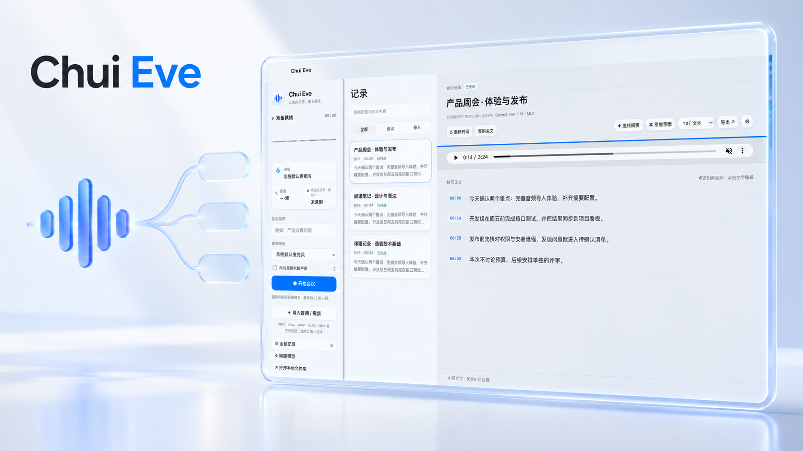
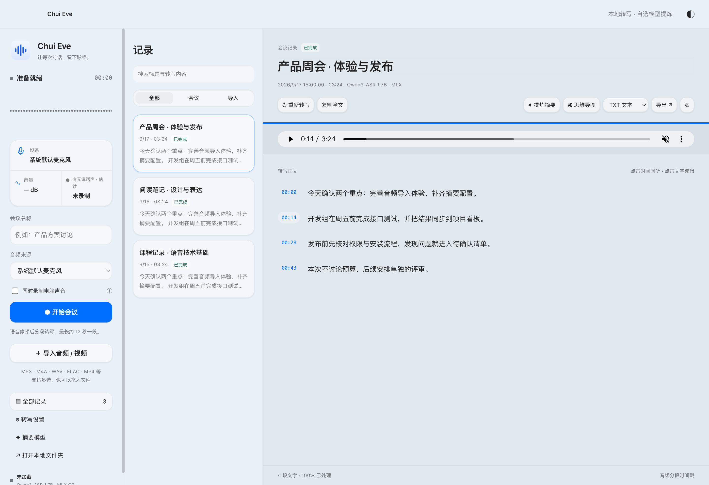
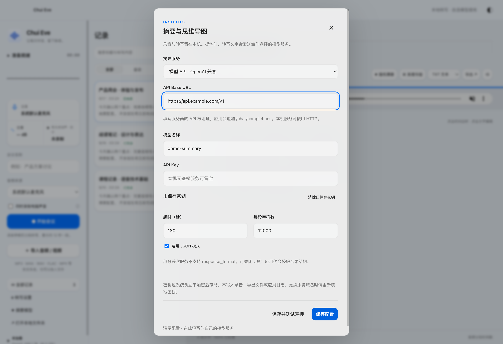
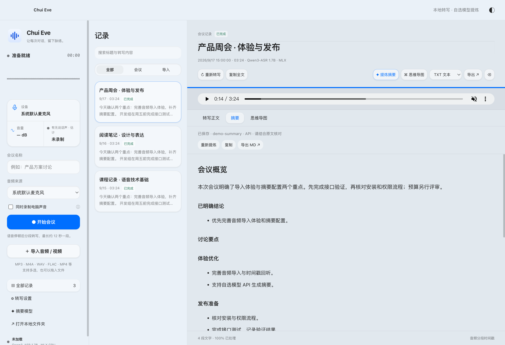
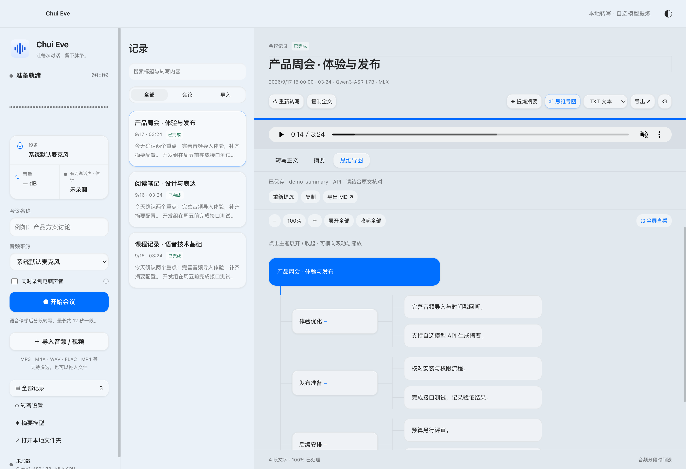

<p align="center"></p>

<h1 align="center">Chui Eve</h1>
<p align="center">让每次对话，留下脉络。<br />Apple Silicon Mac 的本地录音、音频转写与模型提炼工作台。</p>
<p align="center"><a href="https://github.com/vctest23469-bot/chui-eve/releases">下载安装</a> · <a href="docs/INSTALL.md">使用指南</a> · <a href="docs/DEVELOPMENT.md">开发说明</a></p>



> 上图为产品概念 CG；下方为实际应用界面，内容均来自合成演示库。项目采用 MIT 许可证，源码与 Release 公开提供。

## 从声音到可用的记录

Chui Eve 把会议录制、音频导入、时间戳回听和文字整理放在同一个工作台里。ASR 在本机运行；需要摘要与思维导图时，由你选择模型服务。

| 能力     | 使用方式                                                 |
| -------- | -------------------------------------------------------- |
| 本地录音 | 麦克风录制，可选同时录制系统音频；分段转写、尾段保存     |
| 文件转写 | 多选或拖入音频/视频，后台解码与转写，会议任务优先        |
| 记录整理 | 标题/正文编辑、搜索、时间戳回听、失败重试和中断恢复      |
| 摘要提炼 | 概览、明确结论、主题要点、带原文依据的行动项与待确认问题 |
| 思维导图 | 展开/收起、缩放、全屏；与摘要共用结果，不重复请求        |
| 自选模型 | OpenAI 兼容 API，或保留现有 Codex CLI · GPT-5.5          |
| 导出     | 正文 TXT、Markdown、SRT、JSON；摘要和导图大纲 Markdown   |



## 用你自己的模型生成摘要

打开左侧「摘要模型」，填入服务商的 API 根地址、模型 ID 与 API Key，点击「保存并测试连接」。本机无鉴权服务可留空密钥。支持调整分段长度、超时，以及关闭不兼容服务的 JSON 模式。



**录音和转写保存在本机；只有点击提炼时，记录标题和转写文字才会发送到所选服务。** API Key 经系统安全存储加密，不进入录音、导出结果或日志。连接测试不含会议数据；长文本提炼会分段、合并和核对行动项，可能产生多次模型请求和费用。





## 安装与开始

1. 从 [Releases](https://github.com/vctest23469-bot/chui-eve/releases) 下载 Apple Silicon Mac 应用，核对 SHA-256 后解压并拖入「应用程序」。
2. 安装本地 ASR 模型与 Python 环境。模型不包含在应用包内，推荐先使用 Qwen3-ASR 1.7B 4-bit；具体命令见 [安装指南](docs/INSTALL.md)。
3. 授予麦克风权限；录制电脑声音还需要屏幕及系统音频权限。开始会议或导入录音。
4. 转写结束后，配置摘要服务，点击「提炼摘要」或「思维导图」。

平台为 macOS 14+ / Apple Silicon。Release 为 ad-hoc 签名，未做 Apple 公证，首次启动可能需要在系统安全设置中允许。已有本机定制版升级可能需要重新授权权限或填写密钥；请先结束录音并备份数据。

## 开发与质量

```sh
npm ci
node scripts/prepare-runtime.cjs
zsh scripts/setup-mlx.sh 4bit
npm start
npm test
npm run test:ui
npm run package
```

模型、运行时、Python 环境、录音及验证产物均不进入 Git。应用使用隔离渲染器和受限 IPC；模型推理在独立进程，API 请求在主进程。打包按白名单进行，ASR/VAD 使用与 Electron 隔离的 Node 运行时。详见 [开发说明](docs/DEVELOPMENT.md) 与 [v1.2.0 更新说明](docs/RELEASE-v1.2.0.md)。

## 边界

- 实时字幕是分段返回，时间戳不是逐字对齐；不自动分离说话人。
- AI 提炼需回听核对，不确定的责任人与时间不应作为已确认承诺。
- API 使用 OpenAI 兼容 `/chat/completions` 协议；仅提供其他协议的服务不能直接接入。真实供应商效果、费用与限流需按目标模型验证。
- 系统音频效果受 macOS 权限、会议软件和输出设备影响；自动测试不替代真实会议验收。
- 通用安装包不包含实验 Fun-ASR 二进制，不包含模型权重；少见媒体编解码器不保证支持。

## 上游与许可

第三方依赖包括 Electron（MIT 及其附属许可）、sherpa-onnx（Apache-2.0）、ONNX Runtime（MIT）、Silero VAD（MIT）、MLX/MLX Audio（MIT），模型以各模型卡为准。Chui Eve 使用 FFmpeg（LGPL-2.1-or-later），其[对应源码](https://ffmpeg.org/releases/ffmpeg-8.0.1.tar.xz)与构建说明随 Release 提供；本构建没有 GPL/nonfree 编解码器。第三方许可证位于应用资源的 `runtime/licenses` 和 Electron 自带许可证中。

项目原创代码采用 [MIT 许可证](LICENSE)。第三方组件、模型及其附属资源继续适用各自许可证；MIT 不替代上游授权条款。欢迎通过 Issue 反馈问题或提交 Pull Request；请使用合成样本，避免上传真实录音、转写、密钥或其他个人信息。
